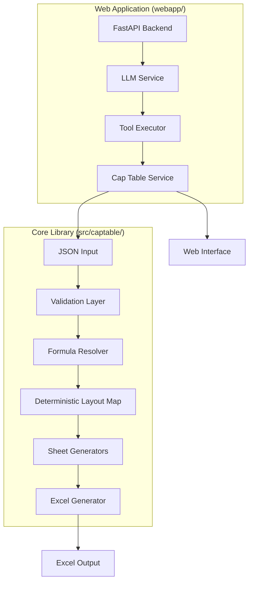

# Cap Table Generator - Architecture Overview

## System Overview

The Cap Table Generator is a comprehensive system for creating dynamic Excel-based capitalization tables from structured JSON data. The architecture is designed for modularity, maintainability, and extensibility.

## High-Level Architecture



## Component Responsibilities

### Core Library (`src/captable/`)

#### 1. Validation Layer
- **Purpose**: Validates JSON input against schema and business rules
- **Key Files**:
  - `validation.py` - Main validation orchestrator
  - `schema.py` - JSON schema definitions
- **Responsibilities**:
  - Schema compliance checking
  - Foreign key relationship validation
  - Business rule enforcement
  - FEO (Formula Encoding Object) validation

#### 2. Formula Resolution
- **Purpose**: Translates symbolic formulas into Excel formulas
- **Key Files**:
  - `formulas.py` - Formula creation methods
- **Responsibilities**:
  - Converting FEO to Excel syntax
  - Placeholder replacement
  - Reference resolution
  - Error handling for undefined references

#### 3. Deterministic Layout Map (DLM)
- **Purpose**: Maps JSON entities to Excel cell addresses
- **Key Files**:
  - `dlm.py` - Reference mapping and resolution
- **Responsibilities**:
  - UUID to Excel reference mapping
  - Named range registration
  - Table reference management
  - Cell address generation

#### 4. Excel Generation
- **Purpose**: Creates Excel workbooks with dynamic formulas
- **Key Files**:
  - `excel.py` - Main generator orchestrator
  - `excel/sheet_generators/` - Individual sheet generators
- **Responsibilities**:
  - Sheet creation and formatting
  - Excel table creation
  - Formula injection
  - Named range definition

### Web Application (`webapp/`)

#### 1. Backend Services
- **Purpose**: Handle LLM-driven cap table operations
- **Key Components**:
  - `llm_service.py` - LLM interaction and streaming
  - `tool_executor.py` - Tool execution
  - `tool_orchestrator.py` - Tool call management
  - `captable_service.py` - Cap table state management
- **Responsibilities**:
  - LLM chat interface
  - Tool call validation and execution
  - State management
  - Change tracking and diffs

#### 2. API Layer
- **Purpose**: RESTful API endpoints
- **Key Files**:
  - `main.py` - FastAPI application
- **Endpoints**:
  - `/api/chat` - Chat with LLM
  - `/api/cap-table` - Get cap table state
  - `/api/cap-table/download` - Download JSON
  - `/api/cap-table/excel` - Export Excel
  - `/api/tool/*` - Tool execution endpoints

#### 3. Frontend
- **Purpose**: Interactive web interface
- **Technology**: React + TypeScript + Tailwind CSS
- **Key Components**:
  - `ChatPane.tsx` - Chat interface
  - `CapTablePreview.tsx` - Cap table visualization
  - `ToolCallApproval.tsx` - Tool approval UI
  - `ExportButtons.tsx` - Export controls

## Data Flow

### 1. JSON to Excel Flow

```
JSON Input
  ↓
Validation (schema + business rules)
  ↓
DLM Creation (UUID → Excel addresses)
  ↓
Sheet Generation
  ↓
Formula Resolution (FEO → Excel formulas)
  ↓
Excel Table Creation
  ↓
Excel Output
```

### 2. Web App Flow

```
User Message
  ↓
LLM Service (tool suggestions)
  ↓
Tool Executor (validation)
  ↓
Cap Table Update
  ↓
Diff Generation
  ↓
Response to User
```

## Key Design Patterns

### 1. Single Responsibility Principle
- Each module has one clear purpose
- Sheet generators handle only their specific sheet type
- Validators focus on specific validation concerns

### 2. Dependency Injection
- Components receive dependencies rather than creating them
- Enables testing and modularity
- Example: FormulaResolver receives DLM instance

### 3. Template Method Pattern
- BaseSheetGenerator defines workflow
- Concrete generators implement specific steps
- Consistent structure across sheet types

### 4. Factory Pattern
- ExcelFormatters creates all format objects
- Centralizes format definitions
- Ensures consistency

## Extension Points

### Adding New Sheet Types
1. Create new generator in `excel/sheet_generators/`
2. Inherit from `BaseSheetGenerator`
3. Implement `_get_sheet_name()` and `generate()`
4. Register in main `ExcelGenerator`

### Adding New Formulas
1. Add method to `FormulaResolver`
2. Follow naming convention: `create_<domain>_formula()`
3. Document with docstring including examples
4. Add to appropriate formula module if specialized

### Adding New Validation Rules
1. Add to appropriate validator module
2. Return list of error strings
3. Follow existing error format
4. Update validator orchestrator

## Performance Considerations

### Excel Generation
- Large cap tables (1000+ instruments) may take time
- Formula resolution is O(n) where n = number of references
- Named ranges reduce formula complexity

### Web Application
- Streaming responses prevent timeout on long operations
- Conversation storage is in-memory (consider persistence for production)
- Tool execution is synchronous but fast

## Security Considerations

### Input Validation
- All JSON input validated against schema
- Foreign keys verified before creation
- Business rules prevent invalid states

### Tool Execution
- Tool calls validated before execution
- Parameter validation prevents injection
- User approval required for destructive operations

## Testing Strategy

### Unit Tests
- Test each component in isolation
- Mock dependencies
- Test edge cases

### Integration Tests
- Test full workflows
- Verify Excel output correctness
- Test formula accuracy

### End-to-End Tests
- Test web app flows
- Test LLM integration
- Test export functionality

## Future Enhancements

1. **Persistence Layer**: Database storage for cap tables
2. **Multi-tenant Support**: Separate workspaces per user
3. **Version History**: Track all changes with rollback
4. **Audit Trail**: Log all operations
5. **Advanced Analytics**: Additional metrics and projections
6. **Import from CSV**: Convert existing Excel cap tables

## References

- [Excel Generation Pipeline](EXCEL_GENERATION.md)
- [Formula System](FORMULA_SYSTEM.md)
- [API Reference](API_REFERENCE.md)
- [Core Library Architecture](CORE_LIBRARY.md)
- [Web Application Architecture](WEB_APPLICATION.md)

