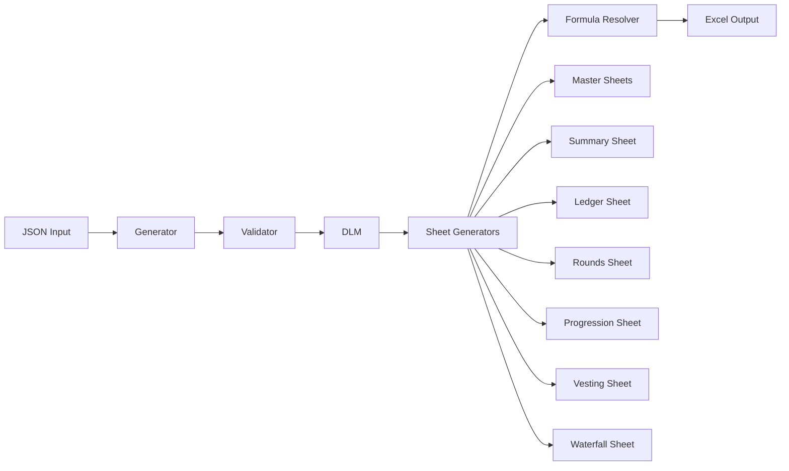

# Core Library Architecture

## Overview

The core library (`src/captable/`) provides the foundational functionality for generating Excel cap tables from JSON data. This document describes the modular architecture of the core library.

## Architecture Diagram



## Module Structure

### `src/captable/generator.py`
**Purpose**: Main orchestrator for cap table generation

**Key Classes**:
- `CapTableGenerator`: Coordinates validation, DLM creation, and Excel generation

**Key Methods**:
- `__init__()`: Initialize with JSON data
- `validate()`: Validate against schema
- `generate_excel()`: Generate Excel workbook
- `get_validation_errors()`: Get validation errors

### `src/captable/validation.py`
**Purpose**: Validates cap table data

**Key Classes**:
- `CapTableValidator`: Main validation orchestrator

**Validation Types**:
- Schema validation (JSON Schema)
- Relationship validation (foreign keys)
- Business rules (uniqueness, required fields)
- FEO validation (formula encoding objects)

### `src/captable/formulas.py`
**Purpose**: Formula creation and resolution

**Key Classes**:
- `FormulaResolver`: Resolves FEO to Excel formulas

**Key Methods**:
- `resolve_feo()`: Convert FEO to Excel formula
- `create_ownership_formula()`: Ownership percentage
- `create_tsm_*_formula()`: Treasury Stock Method calculations
- `create_vesting_formula()`: Vesting schedules
- `create_waterfall_*_formula()`: Liquidation scenarios

### `src/captable/dlm.py`
**Purpose**: Maps JSON entities to Excel addresses

**Key Classes**:
- `ExcelReference`: Represents an Excel reference
- `DeterministicLayoutMap`: Manages reference mapping

**Key Methods**:
- `register_named_range()`: Register global constant
- `register_table()`: Register Excel table
- `register_table_row()`: Map row to entity
- `resolve_reference()`: Get Excel reference for UUID/pointer

### `src/captable/excel.py`
**Purpose**: Excel workbook generation orchestration

**Key Classes**:
- `ExcelGenerator`: Main Excel generator

**Responsibilities**:
- Workbook creation
- Format initialization
- Sheet generation coordination
- Finalization

### `src/captable/excel/`
**Purpose**: Modular Excel generation

#### `excel/base.py`
- `BaseSheetGenerator`: Abstract base for all sheet generators
- `ExcelFormatDict`: Type alias for format dictionaries
- Common utilities (column letter conversion, cell references)

#### `excel/formatters.py`
- `ExcelFormatters`: Factory for creating cell formats
- Centralizes all format definitions
- Ensures consistency across sheets

#### `excel/table_builder.py`
- `TableBuilder`: Utilities for creating Excel tables
- Handles table creation, formulas, validation
- Provides consistent table structure

#### `excel/sheet_generators/`
Individual sheet generators for each sheet type:

- **`master_sheets.py`**: Holders, Classes, Terms reference sheets
- **`summary_sheet.py`**: Global constants and named ranges
- **`ledger_sheet.py`**: Instruments with ownership calculations
- **`rounds_sheet.py`**: Financing round details
- **`progression_sheet.py`**: Cap table evolution across rounds
- **`vesting_sheet.py`**: Vesting schedules for options
- **`waterfall_sheet.py`**: Liquidation scenario analysis

## Reference Resolution

### Named Ranges
Global constants accessible throughout the workbook:
- `Current_PPS`: Current price per share
- `Current_Date`: Evaluation date
- `Exit_Val`: Exit value for waterfall
- `Total_FDS`: Total fully diluted shares

### Structured References
Table column references using Excel's structured reference syntax:
- `Ledger[@[current_quantity]]`: Current row's quantity
- `Ledger[[current_quantity]]`: Entire column
- `Holders[holder_name]`: Column reference

### Cell References
Direct cell addresses:
- `Summary!$B$5`: Specific cell reference
- `Rounds!$E$2`: Cross-sheet reference

## Formula Resolution Pipeline

### 1. FEO Parsing
```python
feo = {
    "is_calculated": True,
    "formula_string": "SharesHeld / TotalFDS",
    "dependency_refs": [
        {"placeholder": "SharesHeld", "path": "...", "reference_type": "..."},
        {"placeholder": "TotalFDS", "path": "Total_FDS", "reference_type": "named_range"}
    ],
    "output_type": "cell_reference"
}
```

### 2. Reference Resolution
For each `dependency_refs` entry:
- `path` → Excel reference using DLM
- Resolve based on `reference_type`
- Store as `placeholder → Excel_ref` mapping

### 3. Placeholder Replacement
Replace placeholders in `formula_string`:
```python
formula = "SharesHeld / TotalFDS"
replacements = {"SharesHeld": "Ledger[@[current_quantity]]", "TotalFDS": "Total_FDS"}
result = "Ledger[@[current_quantity]] / Total_FDS"
```

### 4. Formula Writing
Write to Excel:
```python
sheet.write_formula(row, col, f"={result}", format)
```

## Excel Workbook Structure

### Sheet Order
1. **Holders** - Master reference sheet
2. **Classes** - Security class reference
3. **Terms** - Terms package reference
4. **Summary** - Global constants
5. **Ledger** - Instruments table
6. **Rounds** - Financing rounds
7. **Cap Table Progression** - Evolution by round
8. **Vesting** - Vesting schedules
9. **Waterfall** - Liquidation scenarios

### Table Naming Convention
- Excel tables use PascalCase names matching sheet names
- Enables structured references throughout workbook
- Example: `Ledger` table, `Holders` table

## Error Handling

### Validation Errors
Returned as list of strings with:
- Location (JSON pointer or entity type + index)
- Error message
- Context information

### Excel Generation Errors
Raised as `ValueError` with:
- Error message
- Affected component
- Data that caused issue

## Testing Strategy

### Unit Tests
Test each component in isolation:
- Validator tests for each validation rule
- Formula resolver tests for each formula type
- DLM tests for reference resolution

### Integration Tests
Test component interactions:
- Full generation flow
- Formula resolution with mock data
- Sheet generator integration

### End-to-End Tests
Test complete workflows:
- Generate Excel from JSON
- Verify formulas are correct
- Verify structure matches expectations

## Extension Guidelines

### Adding New Sheet Types
1. Create generator class in `excel/sheet_generators/`
2. Inherit from `BaseSheetGenerator`
3. Implement `_get_sheet_name()` and `generate()`
4. Register in `ExcelGenerator.generate()`

### Adding New Formula Types
1. Add method to `FormulaResolver`
2. Follow naming convention
3. Document with examples
4. Add to appropriate domain module if specialized

### Adding New Validation Rules
1. Add method to appropriate validator
2. Follow existing error format
3. Return list of error strings
4. Integrate into orchestrator

## Performance Characteristics

### Time Complexity
- Validation: O(n) where n = number of entities
- DLM creation: O(n) for each entity type
- Formula resolution: O(m) where m = number of formulas
- Excel generation: O(n) for data + O(k) for formulas where k = number of calculated fields

### Space Complexity
- O(n) for data structures
- O(m) for formulas
- O(p) for generated Excel where p = file size

## Best Practices

1. **Keep modules focused**: One responsibility per module
2. **Document everything**: Public APIs need docstrings
3. **Type hints**: Use everywhere possible
4. **Error messages**: Make them informative and actionable
5. **Test coverage**: Aim for >80% coverage on critical paths

